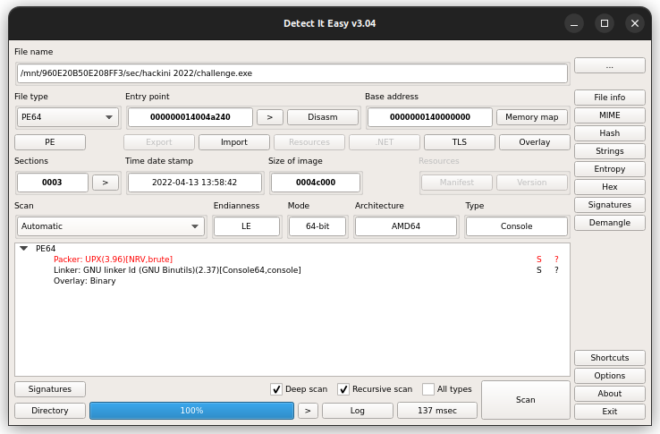

# 6pack

## Description:

> Tags: easy/medium

> My friend sent me this binary.
He said that it's ultimaty packed.
Help me to unpack it.

> Author : yh_0x7

> File : [challenges.exe](challenge.exe)

## First thoughts:

The binary is a Windows Executable, and from the description wen know that it's a packed binary and we have to unpack it. We also notice in the description that the word `ultimaty` is misspelled.

My first thought is that the binary is packed with UPX.

## Detecting It Easily:

Using Detect-It-Easy, we find that the binary is packed with UPX 3.96.



## Unpacking the binary:

With the UPX utility, we unpack the binary with the command:
```
upx -d challenge.exe
```
and the result we got is:
```
                       Ultimate Packer for eXecutables
                          Copyright (C) 1996 - 2020
UPX 3.96        Markus Oberhumer, Laszlo Molnar & John Reiser   Jan 23rd 2020

        File size         Ratio      Format      Name
   --------------------   ------   -----------   -----------
    293572 <-    134852   45.93%    win64/pe     challenge.exe

Unpacked 1 file.
```

and so we got the unpacked binary `challenge.exe`.

## Reversing the binary:

For the reversing part, I used `Ghidra Decompiler`.

We open the binary with `Ghidra` and let it detect and decompile the binary for us. Taking a look at it's functions, we find the `main` function.

```c

int main(int _Argc,char **_Argv,char **_Env)

{
  int iVar1;
  FILE *_File;
  char local_48 [60];
  int local_c;
  
  __main();
  for (local_c = 0; local_c < 0x32; local_c = local_c + 1) {
    sprintf(&tmp,"%c",(ulonglong)*(uint *)(&flag_arr + (longlong)local_c * 4));
    strcat(&flag,&tmp);
  }
  printf("Input flag : ");
  _File = (FILE *)(*(code *)__imp___acrt_iob_func)(0);
  fgets(local_48,0x33,_File);
  iVar1 = strcmp(local_48,&flag);
  if (iVar1 == 0) {
    printf("Correct flag!\n");
  }
  else {
    printf("Wrong flag!\nTry Again.");
  }
  return 0;
}
```

Analyzing the code, we found out that the program:

 - Gets the first character from each four characters from the `flag_arr` array and copies it to a `flag` string.
 - Asks for the flag and place it in `local48`.
 - Compare `local48` and `flag`.

So the approach I followed is :
 - Get the data from `flag_arr`.
 - Get the correct characters.
 - submit the flag.

## Solving the challenge:

The `flag_arr` content:

```py
flag_arr = [ 0x73, 0x00, 0x00, 0x00, 0x68, 0x00, 0x00, 0x00, 0x65, 0x00, 0x00, 0x00, 0x6c, 0x00, 0x00, 0x00, 0x6c, 0x00, 0x00, 0x00, 0x6d, 0x00, 0x00, 0x00, 0x61, 0x00, 0x00, 0x00, 0x74, 0x00, 0x00, 0x00, 0x65, 0x00, 0x00, 0x00, 0x73, 0x00, 0x00, 0x00, 0x7b, 0x00, 0x00, 0x00, 0x75, 0x00, 0x00, 0x00, 0x50, 0x00, 0x00, 0x00, 0x78, 0x00, 0x00, 0x00, 0x5f, 0x00, 0x00, 0x00, 0x31, 0x00, 0x00, 0x00, 0x53, 0x00, 0x00, 0x00, 0x5f, 0x00, 0x00, 0x00, 0x34, 0x00, 0x00, 0x00, 0x5f, 0x00, 0x00, 0x00, 0x4e, 0x00, 0x00, 0x00, 0x31, 0x00, 0x00, 0x00, 0x63, 0x00, 0x00, 0x00, 0x33, 0x00, 0x00, 0x00, 0x5f, 0x00, 0x00, 0x00, 0x77, 0x00, 0x00, 0x00, 0x34, 0x00, 0x00, 0x00, 0x59, 0x00, 0x00, 0x00, 0x5f, 0x00, 0x00, 0x00, 0x46, 0x00, 0x00, 0x00, 0x30, 0x00, 0x00, 0x00, 0x72, 0x00, 0x00, 0x00, 0x5f, 0x00, 0x00, 0x00, 0x50, 0x00, 0x00, 0x00, 0x34, 0x00, 0x00, 0x00, 0x43, 0x00, 0x00, 0x00, 0x6b, 0x00, 0x00, 0x00, 0x31, 0x00, 0x00, 0x00, 0x6e, 0x00, 0x00, 0x00, 0x39, 0x00, 0x00, 0x00, 0x5f, 0x00, 0x00, 0x00, 0x42, 0x00, 0x00, 0x00, 0x31, 0x00, 0x00, 0x00, 0x6e, 0x00, 0x00, 0x00, 0x34, 0x00, 0x00, 0x00, 0x52, 0x00, 0x00, 0x00, 0x31, 0x00, 0x00, 0x00, 0x33, 0x00, 0x00, 0x00, 0x32, 0x00, 0x00, 0x00, 0x7d, 0x00, 0x00, 0x00 ]
```

From here, we get te characters we need:

```py
flag = ""
for i in range(len(flag_arr)//4):
    flag += chr(flag_arr[i*4])

print(flag)
```

and we get:
```
shellmates{uPx_1S_4_N1c3_w4Y_F0r_P4Ck1n9_B1n4R132}
```