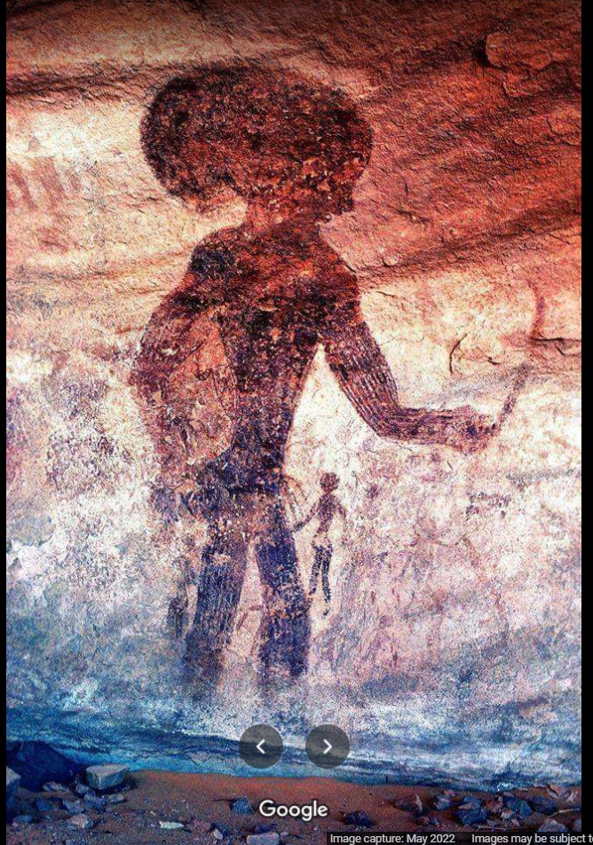

# Alien

## Description:

> Tags: OSINT

> "Located in a strange lunar landscape of great geological interest, this site has one of the most important groupings of prehistoric cave art in the world. More than 15,000 drawings and engravings record the climatic changes, the animal migrations and the evolution of human life on the edge of the Sahara from 6000 BC to the first centuries of the present era. The geological formations are of outstanding scenic interest, with eroded sandstones forming ‘forests of rock’.
https://whc.unesco.org/en/list/179/" -source: read it.

> Author : Elghazali

> File : [Alien.png](Alien.png)


## First thoughts:

It's an OSINT challenge, which means it involves checking the image source, social media pages and links we might find.

## Reverse searching for the image:

With Google's `search by image` service, we search for similar images and we found some links that include the image or similar ones.

The two links that interests me are a [twitter thread](https://twitter.com/nubia_watu/status/1049805034807013376?lang=en) and a [reddit post](https://www.reddit.com/r/algeria/comments/hp592u/tassili_najjer_algerian_sahara_desert_ancient/).

Checking the twitter thread doesn't give us anything valuable.

Checking the reddit post and reading it's replies, we find this reply:


which includes the flag:

```
shellmates{4lg3r1a_1$_B34t1fuL}

```