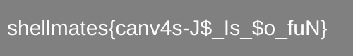

# Image Data

## Description:

> Tags: easy/medium

> You are so nice I'm giving you a canvas image data!
width, height = [500, 80]

> Author : Chih3b

> Files: [imageData.json](imageData.json)

## First thoughts:

In this challenge, we are given a 1.9MB json file, and from the description, we know that it's data for an image with 500px*80px dimensions.

## Checking the file:

The json has a single attribute: `data`, which has 160000 element starting from `0` to `159999`.
Dividing `160000` by the dimensions of the image `500*80` we find `4`, and the number for represents `RGBA` values for each pixel of the image.

## Solving the challenge:

I used Python and `PIL` image manipulation library to recreate the image from the json file.

The [script I used](solve.py).

and I got the following image:



```
shellmates{canv4s-J$_ls_$o_fuN}
```