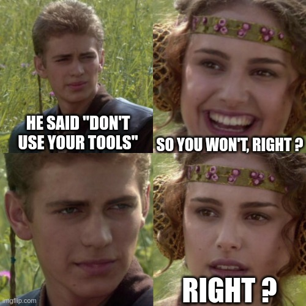
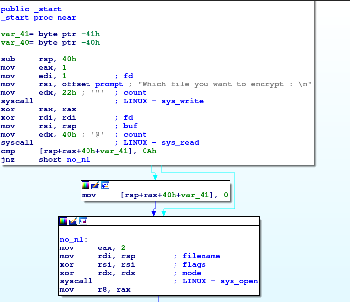
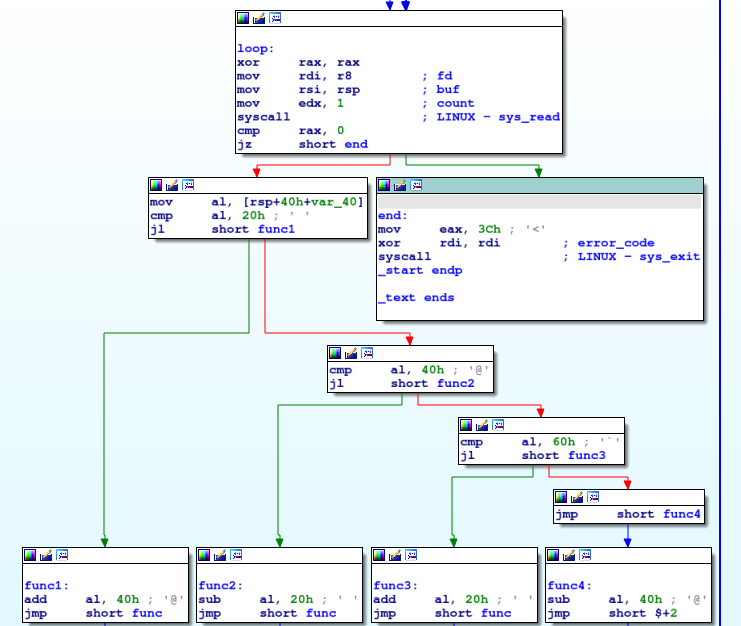

# baby_asm

## Description:

> Tags: easy

>Put your tools aside for a second and start reading some real code.

> Author : Ouxs

> Files : [chall.asm](chall.asm), [enc](enc)

## First thoughts:

The challenge is a assembly code, and it's quite small.
The creator of the challenge asks us to not use our tools :)



## My approach:

As you may or may not know, I am a lazy person, so I took a quite simple easy approach:

 - Compile the assembly code with `nasm`.
 - Open it with `IDA` and check the much better much easier graph :).

## Compiling the code:

We compile the code with the command: 

```
nasm -f elf64 chall.asm -o baby_asm.o
```

And we link it using :

```
ld baby_asm.o -o baby_asm
```

## Analyzing the binary with IDA:

For this challenge, I used `IDA Free` because it has good function graph visualization, and it shows the parameters for `syscall` calls.



In te first part, we find that the program asks for file name, it reads its content.



The second part is a loop that takes each character from the content of the file, tests it and  apply one of the functions on it.

### Tests:

```py
if i < 0x20:
    func1()
else:
    if i < 0x40:
        func2()
    else:
        if i < 0x60:
            func3()
        else:
            func4()
```

### Functions:

 - `func1`: adds 0x40
 - `func2`: subtracts 0x20
 - `func3`: adds 0x20
 - `func4`: subtracts 0x40

## Solving the challenge: decrypting enc file:

I wrote this python script that reverses what the program was doing, and give it the encrypted flag from `enc` file.

```py
enc = "33 28 25 2C 2C 2D 21 34 25 33 3B 62 14 63 6B 7F 74 10 7F 74 28 13 7F 32 10 10 17 15 01 01 3D".split()
flag = ""

for i in enc:
    if int(i, 16) < int(0x20):
        flag += chr(int(i, 16)+int(0x20))
    elif int(i, 16) < int(0x40):
        flag += chr(int(i, 16)+int(0x40))
    else:
        flag += chr(int(i, 16)-int(0x20))

print(flag)
```

and I got:

```
shellmates{B4CK_T0_Th3_r0075!!}
```