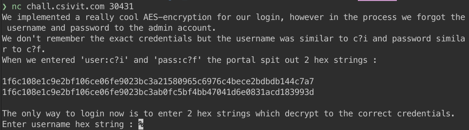
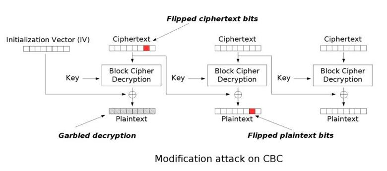

## Challenge Info 

crypto challenge `nc chall.csivit.com 30431`  aes cbc bit flipping attack to change the wrong credentials and submit them to the login service 

## Writeup summary

- general analysis
- AES-CBC brief introduction
- perform attack
- Show me the code 

### general analysis

In this challenge we are given a netcat session to communicate with so when connection from terminal we are given this message :



so basically we are given the encryption of  the credentials that the user has entered in those two hex , the first one being the encryption of `user:c?i` and the second hex is the encryption of `pass:c?f` and we are asked to give the encryption of the correct credentials that means we have to give them the hex encryption of `user:csi` and the hex encryption `pass:ctf`, and because we don't know the key and the iv that the  server is using  so we can't make do encryption in local so the idea here is to do an aes cbc bit flipping attack .

### AES-CBC brief introduction 

As i already know the attack and have used it before this ctf  i will not cover the attack in details so if you need more informations check [this website](https://resources.infosecinstitute.com/cbc-byte-flipping-attack-101-approach/) .

I'll start by a brief explanation of what is `AES-CBC` , so Aes-cbc is a symmetric encryption , it is a block cipher with block size =16 byte , the encryption process goes as explained in this image 


so each block `Bi` is xored with the cipher text of precedent block `Ci-1` and then encrypted , and for the decryption this image explain it as well :


so for the decryption process we will do the inverse so each cipher text `Ci ` will be decrypted first and then xored with the precedent cipher text `Ci-1`

OK now we understand how aes cbc works what about the attack !

### perform attack 



The bit flipping attack affect one byte of a specific block and it allow us to change its value to the value we want without having to decrypt it and encrypt it again .

Lets define some variable first , let's say we have a cipher with 2 block `C0` and `C1` and we want to change byte number 2 in `C1` let's say also that  the result of decryption of each block is called `Li` so for `C0` it is `L0 `  and `Pi` is the plaintext of each block. now let's make some formula: 

```python
Li = dec(Ci)
Pi = Li xor C(i-1)
```

so if we change a value of a byte in a cipher block it will affect the byte of the same position in the next block but how can we know the specific value that will help ,well there is a way to do it let's say that we want to change byte number 2 which value is h (the value in the plaintext ) and want to change it to `a` here are some formula that will help us do this:

```python
Cp0[2] = C0[2] xor "h" xor "a"
```

this will allow us to change the second byte of the second block from `h` to `a`. WHAT STill don't understand okey let's see in the decryption what will happen after changing the `C0[2]` 

```python
P1[2] = L1[2] xor C0[2]
```

and we know that before changing the first cipher we got this lets call it (1)

```python
"h" = L1[2] xor C0[2]
```

and after changing we got this:

```python
P1[2] = L1[2]xor Cp[2] 
P1[2] = L1[2] xor C0[2] xor "h" xor "a"
```

we replace with 1 and we got `h` xor `h`  which is `\x00` and anything xor `\x00`  = anything so finnaly P1[2] = "a"

and that's how the bit flipping works.

### Show me the code 

Now we will apply our knowledge on this challenge,  so basically to solve this challenge we have to get the hex creds username and password and do bit flipping on theme just like this :

```python
username_bytes[6] = username_bytes[6] ^ ord("?") ^ ord("s")
password_bytes[6] = password_bytes[6] ^ ord("?") ^ ord("t")
```

and send it to the service and get your flag `csictf{Sh4u!d_hav3_n0t_u5ed_CBC}`  check out the [solve.py](solve.py) for full solution 