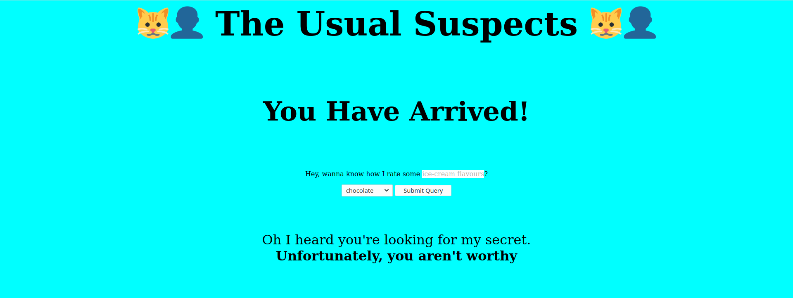
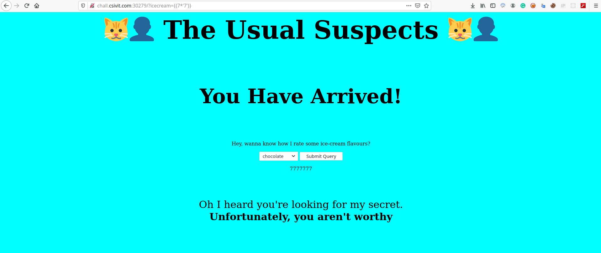
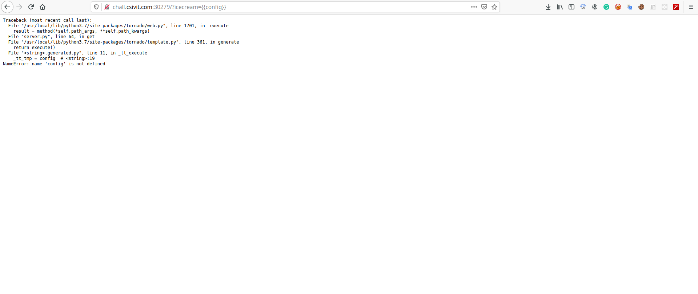
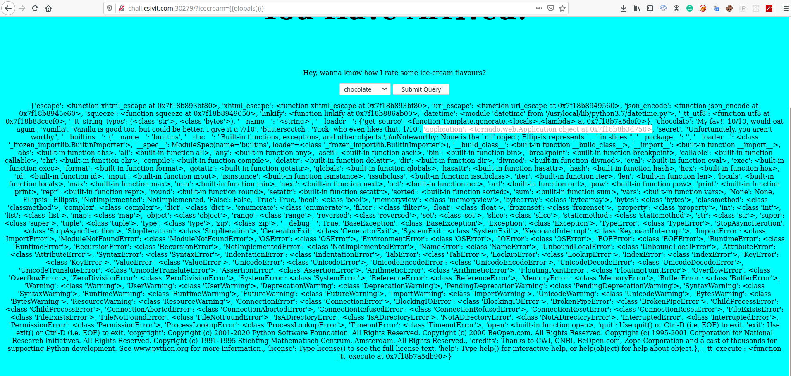

## Challenge Info
Web challenge `http://chall.csivit.com:30279/` , we have a Tornado application vulnerable to server side template injection SSTI. First we need to leak the cookie_secret using ssti and regenrate a cookie with `admin: true ` to get the flag.

## Writeup summary
- Gain general informations
- exploit the ssti parameter and leak the secret 
- regenerate a tornado cookie

### Gain general informations
When we visit the website we got a page with a form to submit an ice-cream flavours:

 

the request look like `http://chall.csivit.com:30279/?icecream={{chocolate}}` and directly we noticed the possibility of an SSTI attack in icecream parameter.

### Exploit the ssti parameter and leak the secret

first we tried this basic payload `{{7*'7'}}` :
 

after that we tried `http://chall.csivit.com:30279/?icecream={{config}}` and the server returned an exception :

 

so the server used here was Tornado, which is an asynchronous python web server. Back to the documentation, we
noticed that tornado.web.Application use `settings` dictionary as a way to make application-specific settings like `cookie_secret` available to handlers without using global variables [tornado settings](https://www.tornadoweb.org/en/stable/web.html#tornado.web.Application.settings)

visiting ` http://chall.csivit.com:30279/?icecream={{globals()}} ` and we got :

 

we know that the name of the variable `tornado.web.Application()` is `application` so the final payload to get the secret was `?icecream={{application.settings["cookie_secret"]}}` and we had the value `MangoDB`  displayed on the website.

## Regenerate a tornado cookies :

Signed cookies in tornado apps contain the encoded value of the cookie with a timestamp and an HMAC signature [from github](https://github.com/tornadoweb/tornado/blob/master/tornado/web.py#L3349).
We regenerate the new cookie with required value `true` to get the flag `csictf{h3r3_i_4m}`, check out the [forge_tornado.py](forge_tornado.py).
